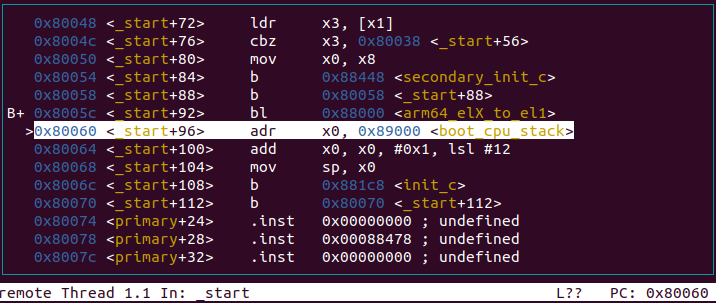
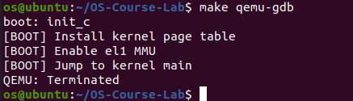
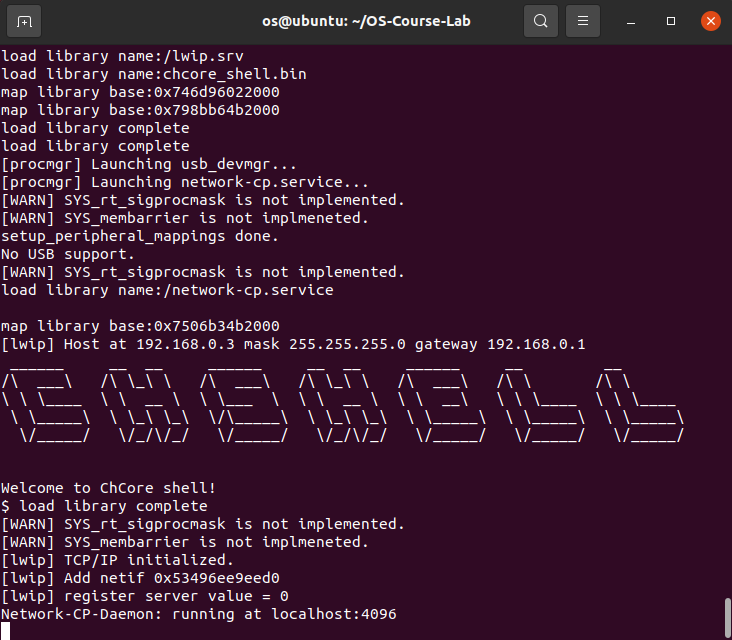
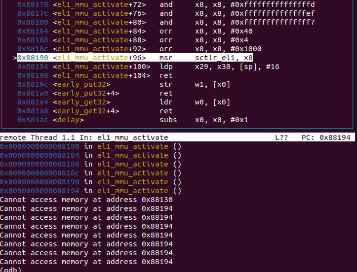

# ChCore-Lab1

<p align="right">杨乐天</p>

## 思考题1

在`_start`函数中，有如下代码：

```assembly
│  >0x80000 <_start>        mrs     x8, mpidr_el1                              │
│   0x80004 <_start+4>      and     x8, x8, #0xff                              │
│   0x80008 <_start+8>      cbz     x8, 0x8005c <_start+92>                    │
```

其中，`0x80000`将`mpidr_el1`寄存器读取到`x8`寄存器上，`0x80004`提取`x8`寄存器的后8个bit，`0x80008`则仅在`x8`寄存器为0的情况下跳转到`0x8005c`。因此这段代码起到了识别CPU核心编号的作用，仅允许`mpidr_el1`后8位为0的CPU核心进入`0x8005c`继续执行，而对于其他的核心，有如下代码：

```assembly
│B->0x8000c <_start+12>     adr     x0, 0x88458 <clear_bss_flag>               │
│   0x80010 <_start+16>     ldr     x1, [x0]                                   │
│   0x80014 <_start+20>     cmp     x1, #0x0                                   │
│   0x80018 <_start+24>     b.ne    0x8000c <_start+12>  // b.any              │
```

此处x1本身不为0，因此必然发生跳转，成为始终运行在`0x8000c`到`0x80018`之间的死循环。

## 练习题2

为了获取当前异常级别，我们只需要使用`mrs`指令读取`CurrentEL`寄存器即可。考虑到下文中的判断使用`x9`寄存器，我们只需要使用`mrs x9, CurrentEL`即可。

```assembly
	cmp x9, CURRENTEL_EL1
	beq .Ltarget
	cmp x9, CURRENTEL_EL2
	beq .Lin_el2
```

## 练习题3

考虑到我们的目标是使用`eret`指令将异常级别从`EL3`转变到`EL1`，我们需要设定跳转地址为`.Ltarget`，并使用`SPSR_ELX_DAIF`屏蔽调试异常、系统错误、IRQ中断以及FIQ中断；使用`SPSR_ELX_EL1H`设置返回后的异常级别。因此我们需要的代码是：

```assembly
	adr x9, .Ltarget
	msr elr_el3, x9
	mov x9, SPSR_ELX_DAIF | SPSR_ELX_EL1H
	msr spsr_el3, x9
```

将代码修改后重新`make build`然后运行能够得到如下结果，即成功回到`_start`函数，表明代码正确。

<center></center>

## 思考题4

C语言的编译器会将C语言代码编译为依赖于栈运行（存储局部变量、进行函数调用）的汇编代码，因此在运行C语言代码之前必须要设置栈。

如果不设置栈，那么栈的寄存器`sp`会指向`0x0`，即默认`0x0`为栈顶开始向低地址增长。在这种情况下运行C语言代码，得到的变量地址均为负值，考虑到overflow机制，最终局部变量的地址很可能指向的是不可用的地址。

## 思考题5

`clear_bss`函数的作用是将程序的`.bss`段初始化为0，而`.bss`段存储的是未被初始化的全局和静态变量。在实验1中，由于我们知道整个物理内存空间都为0，并且我们可以指定各段代码的运行位置确保没有其他程序在`init_c`函数之前访问过`.bss`段分配的物理内存，所以我们知道`.bss`段初始为0，不会对后续使用产生影响。

同理，若不清理`.bss`段导致内核无法工作，这说明在加载`.bss`段之前就有其他的代码使用了这一段内容。

## 练习题6

由于已经有`early_uart_send`函数实现输出单个字符的逻辑，我们只需要对`char*`数组中每一个字符循环输出即可。代码如下所示。

```C
void uart_send_string(char *str)
{
    for (int i = 0; str[i] != '\0'; i ++) {
        early_uart_send((unsigned int)str[i]);
    }
}
```

使用后重新编译运行，得到结果如图所示，说明`uart_send_string`函数成功运行。

<center></center>

## 练习题7

根据代码可知，配置“是否启用对齐检查”和“是否启用指令和数据缓存”都已经配置完成，我们只需要配置“是否启用MMU”即可。因此只需要一行代码`orr	x8, x8, #SCTLR_EL1_M`。

## 思考题8

多级页表相比单级页表能够节省页表内存，且可以将页表所需的整块内存离散化；但是多级页表需要更多次数的访问。

- 页表内存&离散化：考虑4GB的32位虚拟地址空间，每页4KB的单级页表。为了完成一个完整的映射我们需要连续4MB（$(2^{32}/2^{12}) * (32\text{bit}/(8\text{byte}/\text{bit}))=2^{22}\text{byte}$）的连续空间来存储页表。而在多级页表中，我们只需要为程序实际使用的空间分配地址即可，例如在程序只有4KB大小时，单级页表仍然需要4MB的空间，而多级页表可以通过只分配该4KB对应的次级页表项节省很多空间。同时，多级页表存储的地址是不固定、不连续的，对整块内存的要求不高，能够将内存离散化，利用更细小的内存碎片。
- 访问单级页表只需要2次访问，第一次访问页表，第二次访问实际的物理地址。而类似的，访问$n$级页表需要$n+1$次访问。

每个页表项都是$64\text{bit}=8\text{byte}$，共需要$4$个1GB页表项，每个L1页表需要$2^9$个L2页表项，每个L2页表需要$2^9$个L3页表项指向实际物理地址。因此

- 若使用4K粒度，则总计需要物理内存$(4+4*2^9+4*2^{18})*8 \approx 2^{23}\text{byte}$。
- 若使用2M粒度，则总计需要$(4+4*2^9)*8\approx 2^{14}\text{byte}$。

## 练习题9

我们可以直接类比设置低地址的代码，并随时确保变量`vaddr`相比于设置低地址的代码始终有`KERNEL_VADDR`的增量即可。

```C
        /* LAB 1 TODO 5 BEGIN */
        /* Step 1: set L0 and L1 page table entry */
        /* BLANK BEGIN */
        vaddr = KERNEL_VADDR;
        boot_ttbr1_l0[GET_L0_INDEX(vaddr)] = ((u64)boot_ttbr1_l1) | IS_TABLE
                                             | IS_VALID | NG;
        boot_ttbr1_l1[GET_L1_INDEX(vaddr)] = ((u64)boot_ttbr1_l2) | IS_TABLE
                                             | IS_VALID | NG;
        /* BLANK END */

        /* Step 2: map PHYSMEM_START ~ PERIPHERAL_BASE with 2MB granularity */
        /* BLANK BEGIN */
        for (vaddr = KERNEL_VADDR; vaddr < KERNEL_VADDR + PERIPHERAL_BASE; vaddr += SIZE_2M) {
                boot_ttbr1_l2[GET_L2_INDEX(vaddr)] =
                        (vaddr - KERNEL_VADDR) /* high mem, va = pa + C */
                        | UXN /* Unprivileged execute never */
                        | ACCESSED /* Set access flag */
                        | NG /* Mark as not global */
                        | INNER_SHARABLE /* Sharebility */
                        | NORMAL_MEMORY /* Normal memory */
                        | IS_VALID;
        }
        /* BLANK END */

        /* Step 2: map PERIPHERAL_BASE ~ PHYSMEM_END with 2MB granularity */
        /* BLANK BEGIN */
        for (vaddr = KERNEL_VADDR + PERIPHERAL_BASE; vaddr < KERNEL_VADDR + PHYSMEM_END; vaddr += SIZE_2M) {
                boot_ttbr1_l2[GET_L2_INDEX(vaddr)] =
                        (vaddr - KERNEL_VADDR) /* high mem, va = pa + C */
                        | UXN /* Unprivileged execute never */
                        | ACCESSED /* Set access flag */
                        | NG /* Mark as not global */
                        | DEVICE_MEMORY /* Device memory */
                        | IS_VALID;
        }
        /* BLANK END */
        /* LAB 1 TODO 5 END */
```

修改代码后，重新`make build`并运行得到如下输出，说明ChCore正常启动：

<center></center>

## 思考题10

我们认为操作系统是在硬件与应用程序之间架设的桥梁，因此为应用程序所工作的低地址配置页表是自然的。如果不为低地址配置页表，那么MMU会认为低地址所在的区域是不合法的虚拟地址从而拒绝访问，我们也就无法在操作系统上运行任何应用程序。

如果仅从操作系统内核本身的角度来看，在使用`msr sctlr_el1, x8`启动MMU之后，操作系统本身的`boot`部分代码仍然运行在低地址，此时MMU也会仍然认为低地址是非法的虚拟地址，因此无法继续执行（如图所示）。

<center></center>