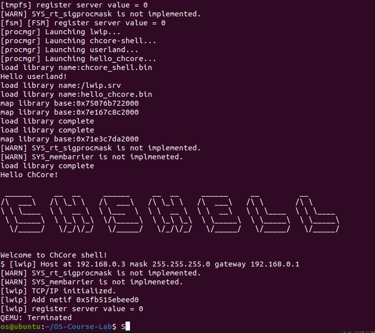

# Report of ChCore-Lab3

<p align="right">杨乐天</p>

## 练习0

根据要求使用`git`命令拉取`musl-libc`后运行`make build`不报错，即为正确编译。


## 练习1

`sys_create_cap_group`与`create_root_cap_group`函数都是用于创建进程，因此二者的实现几乎一致，唯一的区别就在于`create_root_cap_group`创建的是进程`procmgr`，调用者仅可能是操作系统，不需要`sys_create_cap_group`函数中那样在执行具体任务之前做大量检查。

对于函数中的几个`TODO`，我们从上下文就能推测出我们分别需要调用`obj_alloc`函数和`cap_group_init`函数完成内存分配和初始化。其中`sys_create_cap_group`函数中badge参数使用`args.badge`，而`create_root_cap_group`中该参数遵循注释的提示，使用`ROOT_CAP_GROUP_BADGE`。


## 练习2

对于获取offset, vaddr, filesz, memsz的TODO，我们注意到在该段TODO之前的一行代码实现了从`procmgr`进程中读取`flags`的功能，其中对应的参数是`PHDR_FLAGS_OFF`。因此我们只需要对于这三个量实现相同的功能即可。

对于下一个TODO，显然我们需要完成`segment_pmo`的设置，即使用`create_pmo`完成内存分配操作。

最后的两个TODO只要根据注释使用`memset`和`memcpy`函数进行文件内容的复制并对`vmr_flags`变量进行设置即可。


## 练习3

根据注释要求，我们对上下文中的寄存器`thread->thread_ctx->ec.reg`进行设置，其中`SP_EL0`和`ELR_EL1`需要的参数都在函数参数中给出，而`SPSR_EL1`中则存储跳转到EL0，即`SPSR_EL1_USER`。


## 思考题4

在完成初始化之后，内核调用`eret_to_thread()`函数，填写异常向量表`set_exception_table()`，触发一个同步异常`sync_el0_64()`，异常处理完成后进入用户态`EL0`，执行用户态程序。


## 练习5

根据README中的表格填写异常向量表即可。


## 练习6

`exception_enter`函数用于处理发生异常时的上下文保存，其中`SP_EL0`、`ELR_EL1`和`SPSR_EL1`的保存都已经给出，我们只需要保存剩余的所有通用寄存器即可。（需要设置新的栈帧因此要先对`SP`进行减操作）

`exception_exit`即为`exception_enter`的逆过程。

`switch_to_cpu_stack`只需要模仿`switch_to_thread_ctx`函数即可。


## 思考7

`printf -> vprintf -> vfprintf -> stdout -> __stdout_write -> __stdio_write -> syscall -> __syscall3 -> __syscall6 -> chcore_writev -> chcore_write -> write`

其中`write`的实现定义为`chcore_stdout_write`函数。


## 练习8

我们根据`printf`的调用关系找到所需的put函数，填入`chcore_syscall2(CHCORE_SYS_putstr, (vaddr_t)buffer, size);`即可。


## 练习9

编写

```C
int main(int argc, char const *argv[]) {
    printf("Hello ChCore!\n");
    return 0;
}
```

后使用`musl-gcc`进行编译，将得到的`.bin`文件复制到`ramdisk`文件夹中，然后运行`make qemu`即可得到所需的结果。

<center></center>
