# Introduction

The whole Internet is devided into different **tier**s. Tier-1 ISPs are nation-level ISPs, which covers international information transportation; Tier-2 ISPs are region-level, who buys services from Tier-1 ISPs; Tier-3 and local ISPs are the close nodes to end systems.

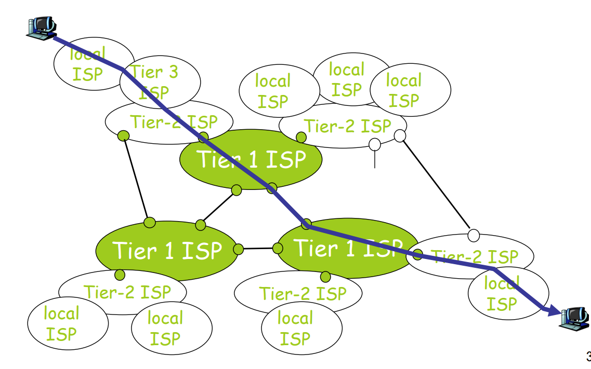

Internet protocol stack: **application** $\rightarrow$ **transport** $\rightarrow$ **network** $\rightarrow$ **link** $\rightarrow$ **physical** (layer).

​	
- **<u>Def</u> Encapsulation(封装)**: When message is passed from application layer through physical layer, each layer adds a header, the process of which is called **encapsulation**, while the reversed process **decapsulation**.
	- **Message** $\stackrel{\text{transport}}{\longrightarrow}$ **Segment** $\stackrel{\text{network}}{\longrightarrow}$ **Datagram** $\stackrel{\text{link}}{\longrightarrow}$ **Frame**.
    
	- The intermediate nodes include **Routers(路由器)** and **Switches(交换机)**. Routers analyzes to network layer while switches analyzes to link layer.

- **Classification** of networks through:
    - **Physical Media**: guided / unguided. Guided media (usually solid) twisted pair / fiber optics / coaxial cable. Unguided media is where signals propagate freely, e.g. atmosphere.
    - **Topology**: bus / star / ring / tree.
    - **Scale**: personal (area network) \to local \to metropolitan \to wide \to The Internet. LAN has broadcast technology and only have bus/ring topology. WAN is network core/backbone.

- **Protocol** defines the format of messages transmitted and actions taken on transmission. Usually complex. **Protocol layering** is introduced to (1) reduce design complexity, (2) maintain independence between each other (**interfaces** introuced to use services offered by the underneath protocol).

    **Requests for Comments(RFC)**: the Internet standards developed to specify the content of protocols. Public protocols are specified in RFCs while proprietary ones are not.

- **Classifications** of services: connection-oriented vs. connectionless (post-like) / reliable vs. best effort.
	
	- Reliability contains different meanings including whether content is ensured correct and whether the order in which packages are tranported is correct. Best effort doesn't ensure reliability.

- Structure of Network: **Network Edge** (applications and hosts) + **Access Networks** (physical media, wired/wireless communication links) + **Network Core** (interconnected routers).
	
    - **Network Edge**: client/server model or peer-peer model. P2P model has minimal or no use of dedicated servers.}
	
	    - **Transmission Control Protocol (TCP)**: connection-oriented, have to prepare ahead of transfer and set up states between communicating hosts.

		    TCP offers (1) reliable and in-order data transfer, (2) flow control (sender won't overwhelm receiver), (3) congestion control (when network congests, sender slows down).
		
	    - **User Datagram Protocol (UDP)**: connectionless, unreliable, no flow/congestion controll.
	
    - **Access Networks** used to connect hosts to edge router, including residential/institutional/mobile access networks. Parameter: **Bandwidth** and **Data Rate**.
	
	    - **<u>Def</u> Bandwidth(Hz)**: the range of frequencies transmitted without being strongly attenuated. ``2.4GHz/5GHz'' refers to the central frequency.}
	
	    - **<u>Def</u> Data Rate(bits/sec)**: the rate at which bits are transmitted.}
	
	    - **<u>Thm</u> Shannon's Theorem**: Suppose the signal-to-noise ratio is $S/N$, maximal possible data rate is $R$, bandwidth is $B$, then $R=B\log_2(1+S/N)$.}
	
	        > WiFi often has 20MHz or 40MHz bandwidth. 5G uses 60GHz central frequency.
	
	    - **Residential Access**: point to point access $\rightarrow$ cable modems.
		
		    **Point to Point Access**: Dialup via modem(拨号上网) and ADSL (asymmetric digital subscriber line). Dialup allows only one of surf and phone at same time, while ADSL uses different frequencies for downstream, upstream and telephone respectively.

    - **Network Core** concerns how data is transferred. Two technologies: **circuit switching** and **packet-switching**.

	    - **Circuit Switching**: first figure out the whole route, then reserve corresponding resources (e.g. bandwidth, switch capacity) for the communicating two hosts. (Circuit-like but not really circuit) Resources might be idle if allocated but not actually used, and establishing the circuit is hard.

		    Two means of allocating: **Frequency Division Multiplexing**(频分复用) and **Time Division Multiplexing**(时分复用). TDM is suitable for tasks like video streaming (which prioritize fidelity to continuity) while FDM is suitable for tasks like phone calls (which prioritize real-time transferring to fidelity).
	
	    - **Packet Switching**: users share resources, while routers store packages and forward. Since sequences of all users' packets are mixed together, it requires **statistical multiplexing**. Not suitable for real-time services because delays are unpredictable.

- **Delays**: Types of delays between two single routers: **nodal processing delay**, **queuing delay**, **transmission delay**, **propagation delay**, **total nodal delay**.
  
    Processing Delay: time to examine header and decide direction (including checking for errors).

	Queuing Delay: time before earlier-arriving packets finish transmitting.

    Transmission Delay: length of packet divided by transmission rate.
    
    Propagation Delay: time of one bit's travelling. (e.g. $\gamma c_0$ where $\gamma < 1$ for optic fiber)
    
    Total Nodal Delay: $d_{\text{nodal}}=d_{\text{proc}}+d_{\text{queue}}+d_{\text{trans}}+d_{\text{prop}}$

    $*$ Queuing delay is a statistical thing.

    - **<u>Def</u> Traffic Intensity**: Let packates with $L$ bits arrive at an average of $a$ packates/sec, and $R$ is transmission rate, then $La/R$ is the traffic intensity. As traffic intensity increases to 1, the average queuing delay diverges to infinity.

    - **<u>Def</u> Package Loss**: with limited queue length, increasing average queuing delay increases risks of losing a package due to meeting full queue.

    - **<u>Def</u> Throughput**: the throughput of a transfer with $N$ links each having transmission rate $R_i$ is $\min\{R_1,R_2,...,R_n\}$. Usually the bottleneck link is server or client instead of cores.

  

# Application Layer

- Two application architectures: client-server vs. peer-to-peer.

    **Client-Server Architecture**: the server often has a data center where a large number of hosts are located.

    **P2P Architecture**: self-scalability is the compelling feature, meaning that peer geneates workload and also add capacity through distribution of data between other peers.

- **Process**: the unit of communication (instead of programs). Within same host, processes communicate through OS-defined **inter-process** communication. Whatever the actually architecture taken, one process is labelled as **client** while the other **server**, where the client is referred to as the process initiating communication.

    **Identifier**: includes IP address and host numbers, used to clearify the unique communicating process.

- **Socket/API**: the interface between application layer and transport layer. Programmers only control (1) protocol to transport, (2) several transport-layer parameters.

- Classification of applications through different requirements: (1) loss-tolerant, (2) bandwidth-sensitive vs. elastic, (3) timing-guaranteed, (4) security-ensured.

**Application-layer protocols**: one piece of network applications, defines how messages are passed to each other.

## Web and HTTP

(the World Wide Web, the first Internet application and the Web's application-layer protocol.)

**<u>Def</u> Objects**: the elements of a **Web page** (usually a base HTML-file accompanied by referenced objects). It's simply a file (.html/.jpg/...) addressed by a **URL** (host name + path name).

**Web Browsers** implement the client side of HTTP, while **Web Servers** implement the server side, and are addressable by URL.

**The HyperText Transfer Protocol** defines how clients request Web pages and how servers transfer Web pages, running on TCP. Client initiates TCP connection (build socket), and then access TCP through socket interfaces. It is **stateless** (maintaining no information about the client).

- **<u>Def</u> Persistency**: a TCP connection is ~ if it sends multiple objects.

- **<u>Def</u> Round Trip Time**: Time for a packet to travel forth and back.

    A non-persistent TCP connection needs $2\times\text{RTT} + \text{file transmission time}$ on each request, while a persistent connection with pipelining requires minimum $1\times\text{RTT}$ for all objects.

**HTTP request**: request line + header lines + blank line + entity body. Request line has 3 fields, method + URL + version of HTTP. Header line: "\<field_name\>: \<value\>\n".

- **Methods**: **GET** to request an object, **POST** to request an object depending on what the user entered into form fields (contained in entity body), **HEAD** (for debugging) respond without the requested object, **PUT** to upload an object, **DELETE** to delete an object on server.

**HTTP response**: similar to request except that request line is substituted with status line containing version + status code + phrase.

Combinations of status code + phrase: **200 OK**, **301 Moved Permanently** (client will automatically retrieve the new URL), **400 Bad Request** (the server can't understand), **404 Not Found**, **505 HTTP Version Not Supported**.

- **Web Caches (Proxy Server)**: (located in belonging ISP) Satisfies client request without involving origin server. Connection with origin server only if the object requested is not in proxy server. Intended to (1) reduce response time, (2) reduce traffic, (3) help poor servers deal with requests. It is server and client samewhile.

- **The File Transfer Protocol**: uses client-server architecture. It separates data connection (port 20) and control connection (port 21).

    **<u>Def</u> In-Band/Out-Of-Band Control**: in-band means using the same process to control and transfer (http), while out-of-band means using separate processes (ftp).

- **The Simple Mail Transfer Protocol**: (port 25) client-server architecture, named **mail server** and **user agent** respectively. Mail servers has (1) mailbox containing incoming messages, (2) message queue of outgoing mail messages. They are client when sending, server when receiving.

- **The Domain Name System**: offering a map between IP addresses and domain names, host alising (mapping from alias names to canonical names as well as other alias names), load distribution (mapping from one canonical name to multiple IP addresses of replicated Web servers). Two parts: (1) distributed database, (2) application-layer protocol. It adds complexity to network edges, but imposes no burden to cores. Uses UDP protocol.

    **Distributed** to (1) prevent single point failure, (2) prevent intensive traffic volume, (3) reduce physical distance to reduce latency, (4) ease of maintenance.

    **Hierarchical** query process: (1) client queries root DNS server to obtain **Top-Level Domain** server address, (2) queries **TLD** server to obtain **Authoriative DNS** server address, (3) queries **Authoriative DNS** server to get IP address required.

    - **Recursive** query: let root server query TLD server; let TLD server query authoriative server.

    - **Iterative** query: local DNS server completes all querying.

    In DNS service, extra servers called **Local Name Server** act as a proxy. Each ISP has one local DNS server.

    DNS **Caching**: disappears after some time, and TLD server often cached in local server.

    DNS Server Storage: **Resource Records**. Syntax: (Name, Value, Type, TTL).

    - If \<Type>=A, then \<Value> maps \<Name> as hostname to IP address.

    - If \<Type>=NS, then \<Value> maps \<Name> as a domain to the hostname of an authoriative DNS server.

    - If \<Type>=CNAME, then \<Value> maps \<Name> as an alias to the corresponding canonical hostname.

    - If \<Type>=MX, then it's equivalent to CNAME for mail server only.

  

# Transport Layer

## Principles of Reliable Data Transfer (RDT)

Seen as a process `rdt(message)` implemented through a given `udt(message)`. We assume the transfer is unidirectional (despite that control info flows bidirectionally), and use finite state machine to model.

*Characteristics of unreliable channel (of network layer) determines the complexity of RDT protocol.*

- **Finite State Machine**: dashed lines indicating initial states; lines indicating the waiting event and action taken. In RDT over a reliable channel, both sender and receiver needs only one state: waiting for call from above/below.

Typical RDT considers: (1) **bit flipping**, (2) **package loss**.

- **Bit Flipping**: use *Automatic Repeat reQuest* protocols.

    The sender delivers the packet with validation code and 2 same sequence numbers.

    The receiver sends **acknowledgements** (ACKs) or **negative acknowledgements** (NAKs) accordingly.

    In case the ACK/NAK packet is garbled, the sender would always resend the message. In **stop-and-wait** protocols, the sequence number only has to contain one bit signifying the modulo 2 of packet index. Notice that checking `has_seq1(rcvpkt)` in state 0 of receiver deals with garbled ACK/NAK.
    
    
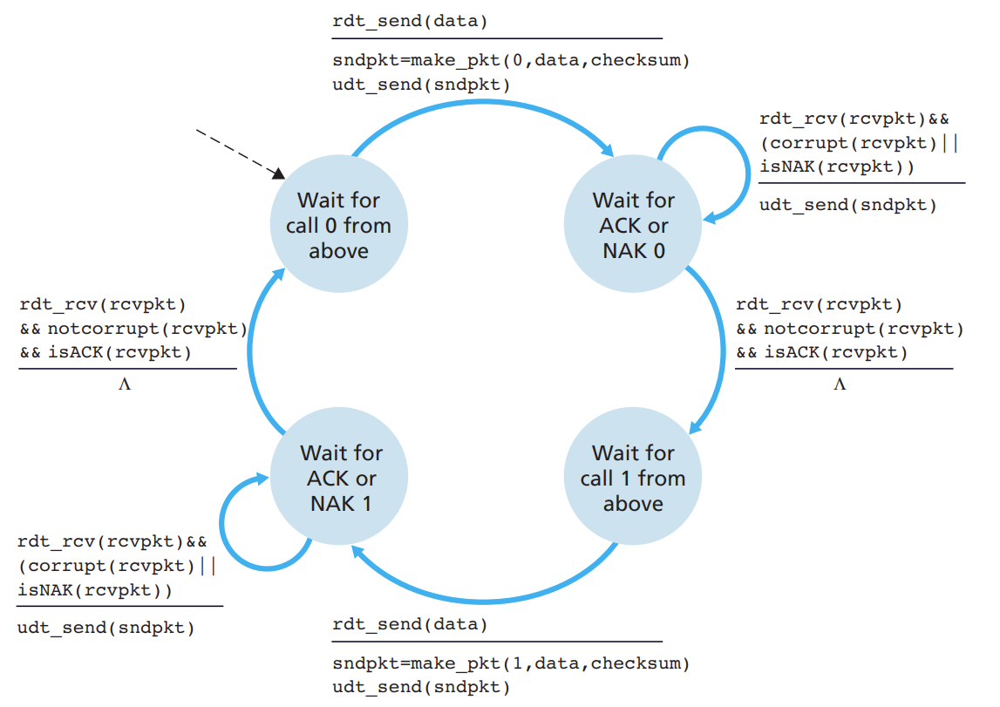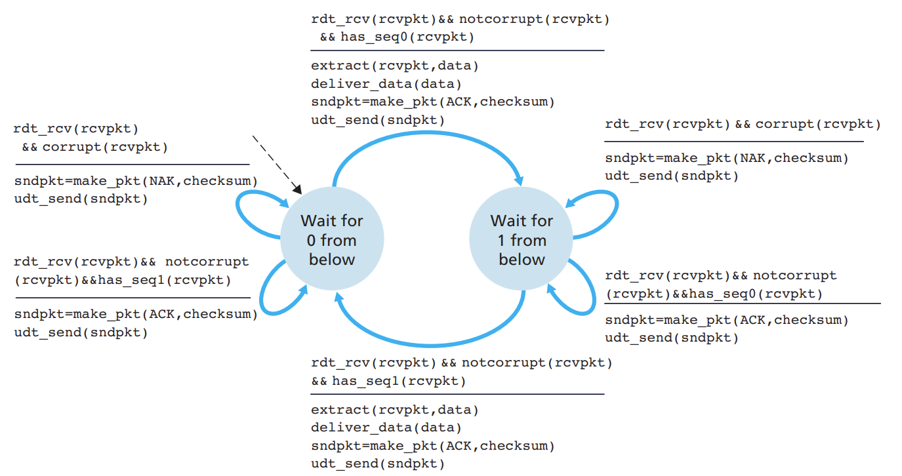

    
    The "NAK" can be eliminated by simply adding "0" or "1" in ACK responses. A duplicate ACK acts as a substitute for NAK.

- **Lossy Channel**: Still **stop-and-wait**, then we only have to add a timer in sender to decide whether to retransmit.

  
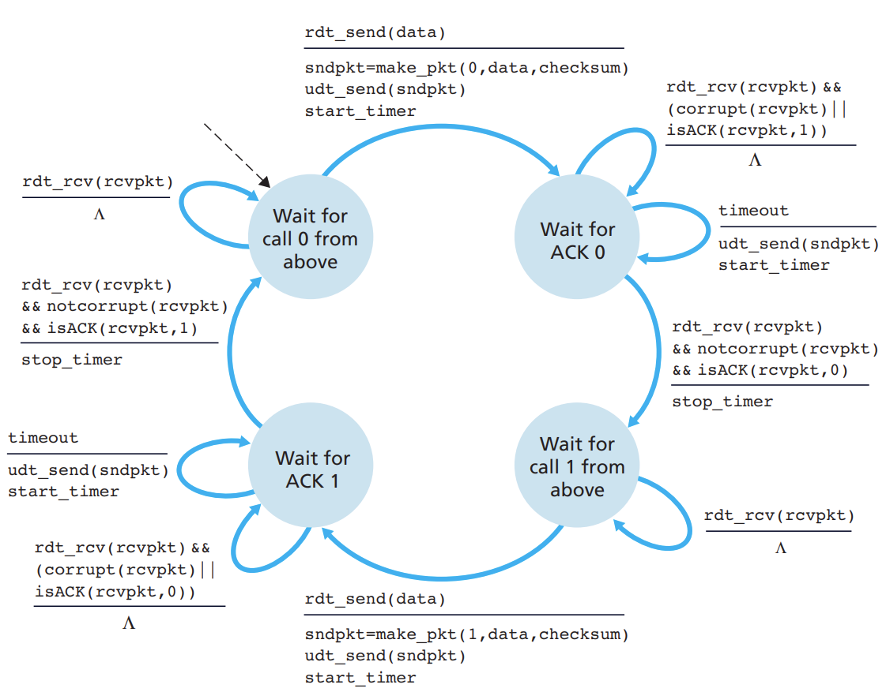

- **Pipelining** the RDT protocol: to change the **stop-and-wait** features. Two approaches: **Go-Back-N** and **selective repeat**.

  **Go-Back-N**: (a *sliding-window protocol*) define `base` as the seq number of the oldest unacknowledged packet, `nextseqnum` as the seq number of the smallest unused seq number, `N` (*window size*) as the largest number of packets allowed to pipeline.

  * Notice that there can only be finite sequence numbers, so the sequence number is under modulo $k$ means.

  For a GBN sender, when invocated from above, it either accepts to transmit or reject when the window is full. After receiver gets a bunch of packets, it send `ACK n` where `n` is the last in-order packet's seq number (**accumulative acknowledgement**) and discard all packages in `[n+1, Inf]`. Then the sender only have to maintain one timer, handling (1) receipt of `ACK n`, do `base=n+1`, send `[base, nextseqnum-1]` again and refresh timer (2) timeout, do send `[base, nextseqnum-1]` and restart timer.

  **Selective Repeat**: (when window size is large and bandwidth-delay product is large) having a logical timer for every single packet. The receiver buffers the correct but out-of-order packets and wait for retransmission before handling it to the upper layer.

  * Window size is still calculated from the last ACK and in-order packet + 1.

  ***Dilemma***: suppose $k=4$ and $N=3$, when all `N` ACK responses were lost, the sender would resend packet `0` but receiver would take it as packet `N`. Solution: $k\ge 2N$.

## Transmission Control Protocol

Properties: **point-to-point** (one sender, one receiver instead of multiple (multi-cast), different from peer-to-peer); **reliable and in-order**; **pipelined**; **full duplex data** (bi-directional data flow, supports a specific *Maximum Segment Size* as the maximum amount of actual data transmitted); **connection-oriented**; **flow controlled**.

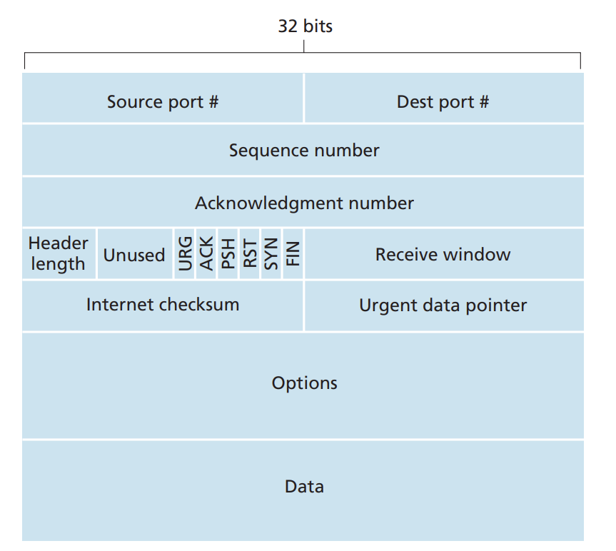

In the TCP segment structure: 

### Sequence Number and Acknowledgement Number

Packet 1 (`A->B`) uses `#seq, #ack` then 2(`B->A`) replies with `#ack, #seq+#bytesIn1`, and `A->B` again replies with `#seq+#bytesIn1, #ack+#bytesIn2`. (`#ack` is the packet expected to receive next)

Reliability ensured by:

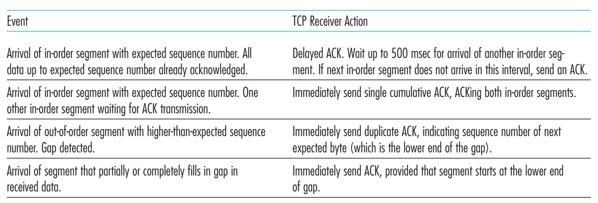

- Through immediately resending not `ACK`ed segment with smallest seq number after triple duplicate `ACK`s are received, TCP does fast retransmission, eliminating the time to wait for timeout.
- Timeout value estimation is slightly different from what is described below in that: whenever timeout happens, `TimeoutInterval` doubles instead of calculating from `EstimatedRTT` and `DevRTT`. But new data sending still uses calculation from `EstimatedRTT` and `DevRTT`.
- Flow control is provided through **receive window** `rwnd` (bytes) which is sent by receiver to make sure the sender won't overwhelm receiver. Specifically, sender still pushes data with one byte to get updated with `rwnd` if sender is once notified that `rwnd=0`.

### Timeout value estimation

`EstimatedRTT = (1-a)*EstimatedRTT + a*SampleRTT` (often take `a=0.125`) to make the curve of `SampleRTT` smoother.

`DevRTT = (1-b)*DevRTT + b*|SampleRTT-EstimatedRTT|` (often take `b=0.25`) to estimate deviation acting as the safety margin.

`TimeoutInterval = EstimatedRTT + 4*DevRTT`.

### TCP 3-way handshake

do `handshake` before exchanging data to ensure both sides agrees on connection.

1. *Client->Server*, let **SYN**=1, and use a random initial sequence number `#seq=client_isn`. (proper `client_isn` can prevent security attacks)

2. *Server->Client*, let **SYN**=1, reply with some `#seq=server_isn` and `#ack=client_isn+1`.
3. *Client->Server*, **SYN** restored to 0, reply with `#ack=server_isn+1`.

$\mathbf{*}$ `1.` and `2.` ensures the server could receive client's packet, while `2.` and `3.` ensures the client could receive server's packet. Then the TCP connection enters `ESTABLISHED` state.

4. *Client->Server*, let **FIN**=1, signifying the *client* can no longer transmit data to *server*, but *server*'s transmission is not restricted. Now state=`FIN_WAIT_1`.
5. *Server->Client*, ACKs the **FIN** segment from client. When client receives the ACK packet, enter state `FIN_WAIT_2`.
6. *Server->Client*, let **FIN**=1, confirming closure of connection.
7. *Client->Server*, when *client* receives the **FIN** packet, it replies with an ACK packet and begin waiting for a long time. If during this time, no extra packets received, close; if some packets received, it means its ACK **FIN** packet is lost, then reply ACK again.

### Congestion Control

As described before, with traffic intensity approaches $1$, queuing delay approaches infinity; if the buffer is finite, congestion leads to packet loss; with large queuing delay, unnecessary retransmission further slows down the transmission; losses along the path makes previous efforts futile, thus even making transmission rate gets to zero.

It's assumed that sending application passes data at averaged $\lambda_{\text{in}}$ (bytes/sec) and the arrival rate is $\lambda_{\text{out}}$. Then **offered load** is defined as $\lambda'_{\text{in}}$ (bytes/sec) including the $\lambda_{\text{in}}$ for original data and retransmission as well. Now we have **per-connection throughput** plotted as:

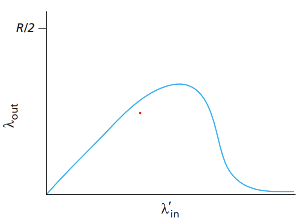

***Solution***: either **end-to-end** (where network layer provides no help, *e.g.* IP protocol) or **network-assisted**.

$\mathbf{*}$ Congestion control is different from flow control in that congestion cares about network while flow cares about the receiver.

TCP assumes that the only reason for loss is buffer overflow and defines **congestion window** `cwnd` (bytes) and ensures `LastByteSent-LastByteACKed <= min{rwnd,cwnd}`. Then the remaining problem is properly determine `cwnd`. First, `cwnd=1*MSS` and `ssthresh=64KB`.

1. *slow start*: when initiated, use slow start. Every acknowledged segment makes `cwnd+=1*MSS`, so that the transmission rate grows exponentially. After the first timeout (loss), set `cwnd=1` and `ssthresh=cwnd/2` and start a new *slow start*. Else, when exponential growth leads to `cwnd=ssthresh`, enter *congestion avoidance* state. Else when three duplicative ACKs received, do *fast transmit* and enter *fast recovery* state.
2. *congestion avoidance*: `cwnd+=(MSS/cwnd)*MSS` for each acknowledged packet. When there is a timeout, behave the same as *slow start*. When there is triple duplicate ACK, `ssthresh=cwnd/2` and `cwnd/=2`, enter *fast recovery*.
3. *fast recovery*: `cwnd+=1*MSS` for each duplicate ACK of the missing segment. When the missing segment is ACKed, enter *congestion avoidance*. When there is a timeout, act like *slow start* and enter *slow start*.

### Fairness

A congestion control mechanism is **fair** if $k$ connections all pass through a bottleneck link with transmission rate $R$ bps get average transmission rate $R/k$ on average.

Suppose the real-time throughput be $\mathbf{v}\in\mathbb{R}^{k}$ where $\mathbf{v}_{i}$ is the throughput of the $i$-th channel, and $\mathbf{v}\in R\times\Delta_{k-1}$ means there is no loss. Notice that each loss makes $\mathbf{v}\leftarrow \mathbf{v}/2$, so according to the graph, $\mathbf{v}$ is closer to the line signifying equal bandwidth share.

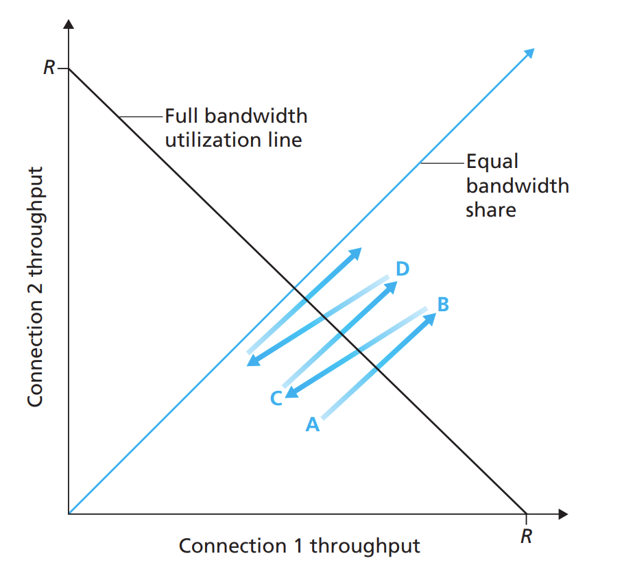

However, when the $\text{RTT}$ differs, those with smaller $\text{RTT}$ obtains larger throughput. Meanwhile, UDP has advantage over TCP because it doesn't have congestion control, and some processes use multiple parallel TCP connections.

# Network Layer

Transport layer transmits data from process to process, while network layer takes on host-to-host segment transmission. Network layer has two key functions: **forwarding** (moving packets to appropriate router output) and **routing** (determine the route to destination). **Forwarding** is considered a **data-plane** task; while **routing** is a **control-plane** task. The differences lies in that: when all IP addresses are physical addresses, we can directly let humans design forwarding table, and thus no *routing* is needed.

**Logically centralized control plane** vs. **Per-Router control plane**: The former let remote controller decide the control plane, while the only part running in the router is the *control agent* storing the *local forwarding table*; The latter let routers exchange local information to form the control plane.

**Network Service Model**: defines characteristics of end-to-end transport; provide with individual datagrams: guaranteed delivery (with bounded delay), and provide with flow of packets: in-order packet delivery, guaranteed minimal bandwidth, guaranteed maximum jitter, and security services.

[*e.g.*] Internet service model: best effort, but nothing guaranteed. Some other network architecture provide assurance for some of the aspects mentioned above.

 

## **Forwarding Functions**

**Abstraction** of network: each object stores a flow table defining a map from *match of patterns* (e.g. `src=1.2.*.*`) in packet header to *actions* (e.g. `drop`). As examples, *routers* match longest IP prefix and `forward`; the firewalls match IP addresses and port numbers and determine `permit` or `deny`.

 

### **Routers**

Input port: received data goes through: (1) line termination (physical layer), (2) link layer protocol, (3) decentralized switching (queuing and forwarding). Then data goes into switch fabric.

- Forwarding: destination-based (according to IP address) or generalized (any other header field values).

  IP destination based forwarding table is a map from some range of destination address to link interface. Uses **longest prefix matching**.

- Switching fabrics: three types, *memory*, *bus* and *crossbar*. Both memory and bus types are limited by the bus bandwidth, while the crossbar types doesn't.

  Switching rate: rate of packet transfer from input to output.

  **Head-of-the-Line Blocking**: datagram at front of the queue prevent others from moving forward.

Output port: data comes from switch fabric and goes through datagram buffer (queuing), link layer protocol and line termination. (Lack of buffer $\to$ congestion)

- Scheduling mechanism: to choose the next packet to send on link. Often use *FIFO*, and *discard policies* include *tail drop*, *priority-based*, and *randomly*. We always assume **Without Preemption Scheduling** (a process can't be interrupted by other processes).

  **Priority scheduling**: always send the highest priority packet. **Round Robin scheduling**: cyclically scan queues and send one from each class. **Weighted Fair Queuing**: (a trade-off between the former two) each class gets weighted amount of service each cycle.

 

### **Internet Protocol**

20 bytes of IP header. Supports fragmentation and reassembly because different link types have different MTU (maximum transfer size). Implemented through a 16-bit identifier, flags and fragment offset.

**IP Address**: 32-bit identifier for each host and router interface. **Interfaces** defines connection between host/router and physical link (routers have multiple, hosts have two: wired and wireless).

- Get an IP address: (1) hard-coded by system admin in a file, (2) **Dynamic Host Configuration Protocol** which dynamically gets an address from server.

  **DHCP**: (1) host broadcast asking (send to $255.255.255.255$ from $0.0.0.0$) whether there is a DHCP server. (2) DHCP server responds offering an IP address, meanwhile providing its own IP address using broadcast (because there might be several different DHCP servers) and defines the lifetime (usually several hours or several days). (3) host send DHCP request message, choosing one from the DHCP servers that responded. (4) DHCP ACK by server.

  - In fact DHCP also returns addresses of: (1) first-hop router for client, (2) IP address of DNS server.

- **Network Address Translation**: all datagrams leaving local network have the same NAT IP address with different source port numbers, therefore a *NAT translation table* stores the map between (WAN addresses, port #) and (LAN addresses, port #). In local network, `10.0.0.0/24` is used. It offers isolation from outside network and saves address resources. But there is contradiction because routers shouldn't modify network layer header. The requirement for addresses should be solved by IPv6 instead.

**Subnets**: a subnet is the interfaces that physically reach without intervening routers, dividing the network into isolated islands.

- *Classless Inter-Domain Routing*: a subnet shares a common IP address prefix with arbitrary length (between 0 and 32). Address format is `xxx:xxx:xxx:xxx/n` where $n$ is the length. In contrast, *classful* addressing allows only 8, 16 and 24 bits corresponding to class A, B, C networks, which is not flexible enough.
- Actually networks get subnets from provider ISP's address space while ISPs get blocks of addresses from **Internet Corporation for Assigned Names and Numbers** (ICANN).

**IPv6**: to extend IP addresses. Requires 40 byte header and no fragmentation. Header defines *priority*, *flow label* and *next header* (identify upper layer protocol). Remove *checksum*.

Transition from IPv4 to IPv6: **tunneling**, IPv6 header carried in IPv4 header, and only the IPv6 routers make use of the IPv6 headers. Therefore, IPv4 routers could be seen as simply wires.

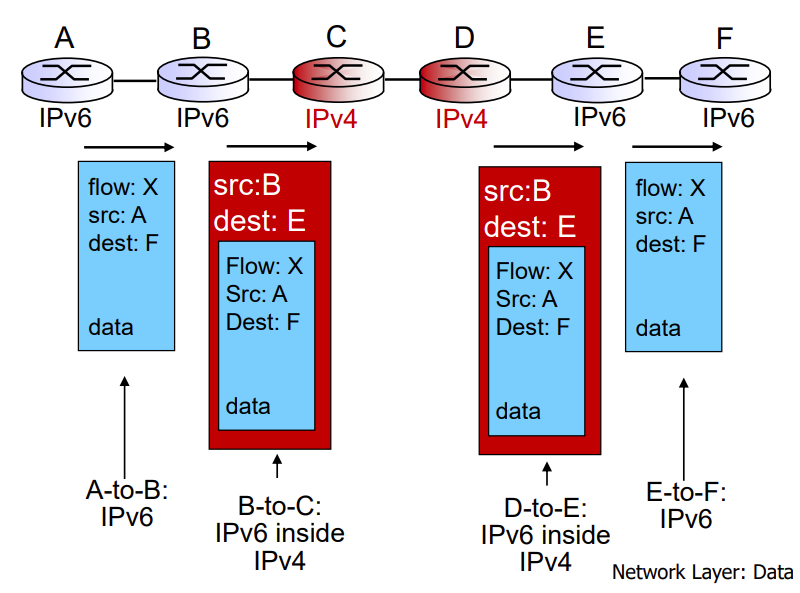

 

## **Routing Algorithms**

**Abstraction** of network: undirected weighted $G=(N,E)$ where $N$ is the set of routers while $E$ is the set of links. Routing algorithms are used to determine good paths, i.e. finding a path minimizing cost.

**Classifications** of routing algorithms: **global information (link-state alg.)** (all routers have complete topology info.) vs. **decentralized information (distance-vector alg.)** (all routers have information of neighbours); **static** (routes change with human intervention) vs. **dynamic** (routes update with change of traffic loads and topology).

### **Link-State Algorithm (Dijkstra)**

For a given start $u$, calculate single-source(destination) minimal distance.

> initiate $D(v)=c(u,v)$ `if` $v\in N(u)$ `else` $\infty$ and $S=\empty$
>
> `while` $\exists w \not\in S$: add $w_0 \not\in S$ with minimum $D(w_0)$ to $S$ and update $D(v)=\min\{D(v),D(w_0)+c(w_0,v)\}$ for all $v$ s.t. $v \not\in S$ and $v\in N(w_0)$.

Efficiency: $O(n\log n)$.

### **Distance-Vector Algorithm (Bellman-Ford)**

> Each node send distance vector $\mathbf{D}_v = \{D_v(y)|y\in N\}$ to all neighbours.
>
> Each node $x$ update according to its own information: for each $y\in N$, $\displaystyle D_x(y) \leftarrow \min_{v\in N(x)} \{c(x,v)+D_v(y)\}$.

In implementation, each node only notifies neighbours when distance vector to any destination is changed because of changes in link cost.

The problem is that only "good" news travel fast. "Bad" news causes **count-to-infinity** problem. *e.g.* In the graph below, DV algorithm needs 44 iterations to converge. A partial solution is **poisoned-reverse**.

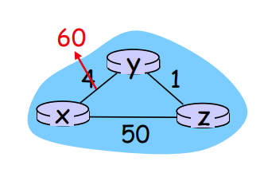

**Comparison** between LS and DV:

- *(message complexity)* LS requires $O(nE)$ messages sent if there are $n$ nodes and $E$ links. But DV has messages online between neighbours.

- *(speed of convergence)* LS costs $O(n^2)$, while DV convergence time varies (*e.g.* routing loops and count-to-infinity).

- *(robustness)* When router malfunctions, LS allows nodes to advertise incorrect costs, but DV would let errors propagate through network.

 

## **AS Routing**

We need **hierarchical routing** because (1) we can't afford networks with billions of routers, (2) ISPs want administrative autonomy for either the sake of freedom or safety (hiding information from outside). The solution is **autonomous systems (AS, or domains)**. Routers in different ASes can use different intra-AS routing protocols.

Therefore, fowarding tables are configured by both intra- and inter-AS routing.

**<u>Def</u> Gateway Router**: The router at edge of an AS, connected to routers in other ASes.

 

### **Intra-AS Routing Procol**(Interior Gateway Protocols, IGP)**: OSPF**

**Open Shortest Path First**: "open" meaning publicly available, uses link-state algorithm. Updates of link-states are broadcast to the entire AS. OSPF messages are carried directly over IP, so the reliability is ensured by OSPF itself.

- Security: only trusted routers can join, to prevent malicious intrusion.

- Multiple same-cost paths, so the flow can be distributed.

- Offers support for uni- and multi-cast routers.

- Supports hierarchy in single AS. In two-level hierarchy, **local area** and **backbone** are defined. **Backbone**s run OSPF only in backbone; while routers in **local area**s only have to remember the direction towards backbone.

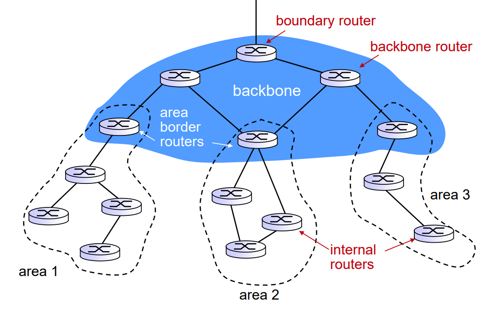

 

### **Inter-AS Routing Protocol: BGP**

**Border Gateway Protocol**: providing **eBGP** (obtain reachability information from neighbouring ASes) and **iBGP** (propagate reachability information to AS-internal routers), allowing subnet to advertise its existence.

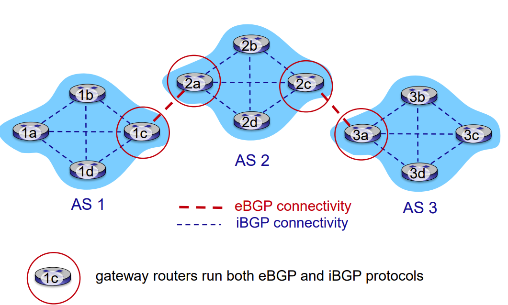

Notice that there might be more than one routes from a specific router to a specific subnet, BGP needs to determine the best one. When a subnet advertises its prefix using BGP connection, some **attributes** are attached.

**Attributes**: **AS-PATH** (the already passed ASes) and **NEXT-HOP** (the IP address of the router interface that begins the current AS-PATH).

- When a router sees its own AS in **AS-PATH** it will reject the advertisement, thus preventing *advertising loops*.

**Hop Potato Routing**: Minimize the cost within AS.

**BGP Routing**: (1) (highest priority) *local preference* (completely a policy thing), (2) shortest AS-PATH (that is, counting the minimal AS hops instead of router hops), (3) hot potato routing.

BGP Routing isn't selfish!

* If an intermediate ISP $A$ doesn't want to carry traffic from ISP $B$ to ISP $C$, it can simply choose not to advertise $ABx$ to $C$.
* There might also be **dual-homed** customers, who can operate like $A$ to prevent itself carrying traffic between ISPs.

 

### **Software Defined Networking**

SDN uses logically centered control plane. There are three planes: (1) SDN-controlled switches (data plane), (2) SDN controller, (3) network-control applications (routing/access control/...).

**SDN-Controlled Switches** require protocol for communicating with controller and API for table-based switch control (*e.g.* OpenFlow). Only does data-plane forwarding.

**SDN-Controller** maintains network state information. Uses **northbound API** to interact with control applications and **southbound API** to interact with network switches.

**Network-Control Apps** uses API provided by controller to implement control functions. It is unbundled so can be provided by 3rd party.

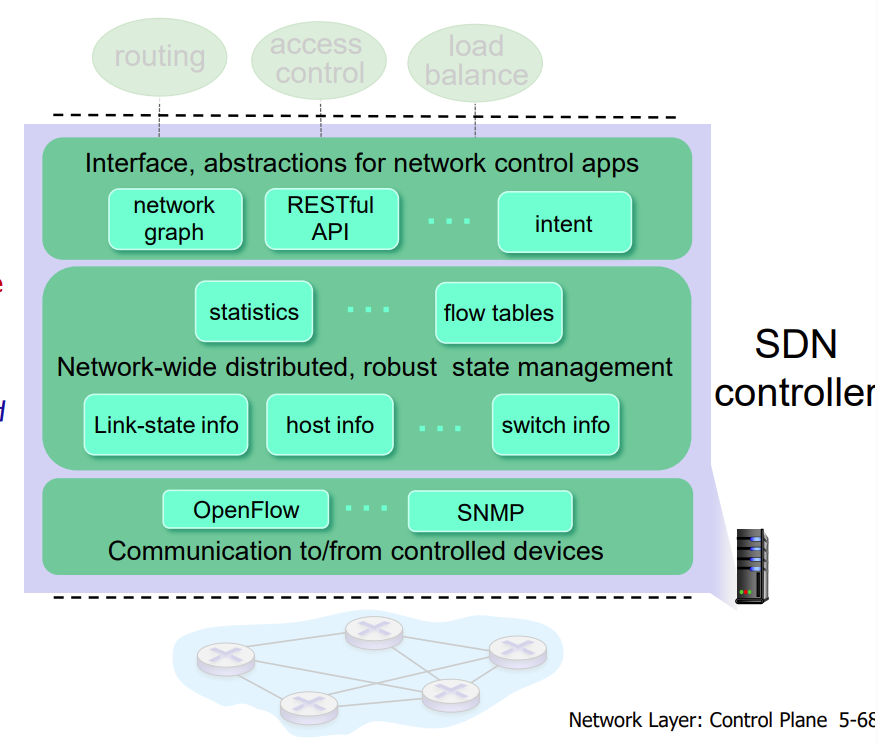

**OpenFlow protocol**: operates between controller and switches. Three types of messages: (1) controller-to-switch, (2) asynchronous (switch to controller) and (3) symmetric.

- Controller-to-switch messages include: queries of switch **features**, queries and sets of **configuration parameters**, modify **flow entries** in OpenFlow tables, command of **sending a packet** out of specific switch port.

- Switch-to-controller messages include: transfer **in-packet** to controller if no flow table matched, inform controller of **removed flow** or changes on **port status**.

***Missing: OpenDaylight***

 

## **Internet Control Message Protocol**

Used to communicate network-layer information, *e.g.* report errors, and echo requests/replies. Its messages are carried in IP datagrams.

Message format: \<Type> + \<Code> + First 8 bytes of IP datagram, *e.g.* 0+0 is ping reply while 8+0 is ping request.

 

## **Network Management**

Each agent maintain a **management information base** containing data like statistics, while the managing server can access those data or set them.

**Simple Network Management Procotol** (SNMP): application layer. Works in two ways: (1) managing entity requests data from agents, (2) agent send a **trap message** to manager, informing it of a change of MIB item.

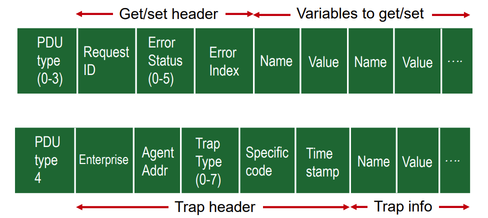

 

 

# **Link Layer**

**<u>Def</u> Node**: any device that runs a link-layer protocol.

**<u>Def</u> Link**: communication channels connecting adjacent nodes. (wired/wireless/LAN)

​	Two types of links: point-to-point and broadcast (multiple access, *e.g.* ethernet and 802.11).

 

Link layer offers **framing** and **encapsulating** of (IP) datagram, and **error detection** and **correction**. Uses **medium access control** (MAC) protocol to rule link layer transmission. Implemented in every host inside **adaptor** or **network interface card** (NIC).

**Error Detection**: Append $\text{EDC}$ bits after $\text{D}$ (the data to protect). The simplest $\text{EDC}$ is single bit parity, but not strong enough. **Two-dimensional bit parity** and **cycle redundancy check** (given generator $G$ with $r+1$ bits, sender determines remainder $R$ satisfying $D\times 2^r \text{XOR} R =nG$ through formula $R=\text{rem}\frac{D\times2^r}{G}$, and the receiver only has to check whether $\langle D,R\rangle =0(\text{mod} G)$) are more often used.

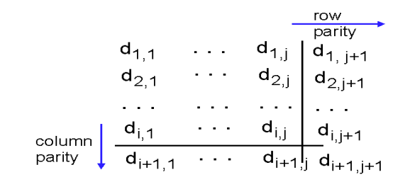

 

## **Multiple access protocol**

Uses single shared broadcast channel; handles collision if more than one signal are received; has distributed algorithm that determines how nodes share channel.

- Ideal MAP should give each node $R/M$ rate when $M$ nodes want to transmit through a $R\text{bps}$ link, and there is no special node to coordinate and no synchronization of clocks, slots.
- Taxonomy: *channel partitionining*, *random access* and *taking turns*.

**Time Division Multiple Access** (TDMA): nodes access channels in "rounds", but unused slots go idle. Similar approach is **Frequency Division Multiple Access**.

**Slotted ALOHA**: Assuming all frames have same size and the sending times are synchronized, and when collision happens, all nodes detect it. Then the solution is: when collision happens, the node retransmits frame in each subsequent slot *w.p.* $p$ until success.

- need synchronization and has idle slots.
- Max efficiency is $\lim_{N\to \infty} Np(1-p)^{N-1}=1/e$. For unslotted ALOHA, collision happens for receiving time during $[t_0-1, t_0+1]$, and thus $\text{Pr}[success]=p(1-p)^{2(N-1)}$, the optimum $p$ leads to max efficiency $1/2e$.

**Carrier Sense Multiple Access**: not interrupting others. But collisions still happen because of propagation delay.

**CSMA/Collision Detection**: when collision detected, abort the transmission. Easy for wired LANs by measuring signal strengths, but difficult for wireless LANs because received signal strength is overwhelmed by local transmission.

For ethernet, the NIC enters **binary exponential backoff**: after the $m$-th collision, NIC waits $K\times 512$ bit times where $K$ is selected at random from $\{0,1,...,2^m-1\}$.

- Efficiency: suppose $T_{\text{prop}}$ is the max prop dela between 2 nodes in LAN and $T_{\text{trans}}$ is the time to transmit max-size frame, then $\text{eff}=\frac{1}{1+5T_{\text{prop}}/T_{\text{trans}}}$.

For 802.11, detecting all collisions is impossible, so it is **CSMA/Collision Avoidance** instead. Consider **hidden terminal problem**, ACKs are needed. The operations are as follows:

- For sender, the frame is not transmitted until **DIFS** or **timer expiration**. If channel is busy, then start timer whose countdown time is determined by binary exponential backoff. The timer only counts down when channel is idle. If no ACK received, then backoff interval is increased and sending process is performed again.
- For receiver, ACK after SIFS.

Another way of avoiding collisions is to use **request-to-send** packets (sent to routers) and **clear-to-send(client)** (sent from router to all clients) responses.

**Taking-Turns**: **Polling** where master node invites slave nodes to transmit in turn (but suffers from latency and fear of failure of master, used by Bluetooth), or **token passing** allowing only the token holder to send.

 

## **Local Area Networks**

### **Medium Access Control**

**MAC Address**: 48bit burned in NIC ROM, sometimes software settable. Uniqueness ensured by IEEE. Analogy: MAC address $\leftrightarrow$ ID card No., IP address $\leftrightarrow$ postal address.

**Address Resolution Protocol**: figure out MAC address (which is used in link layer) by IP address. Each IP node maintains an ARP table, with each item recording `IPaddr; MACaddr; TTL`. TTL refers to the time after which address mapping will be forgotten (often 20min).

Process: sender broadcasts ARP query, asking who has IP address `xxx.xxx.xxx.xxx`, and the node holding such IP address replies sender.

### **Ethernet**

Topology: bus or star. Format is `preamble, dest.addr, source.addr, type, data, CRC` where `preamble` has $8$ bytes, $7\times 10101010 + 1\times 10101011$, used to synchronize receiver, sender clock rates. `type`: indicate network layer protocol.

Features: **connectionless**, **unreliable** (data dropped if CRC failed), uses **CSMA/CD** with binary backoff.

### Ethernet Switches

Switches are **transparent** to hosts and routers. They store and *selectively* forward Ethernet frames. It is as simple as *plug-and-play*, it is **self-learning**.

Switches can make collision domain restricted to links with each host itself. (Implemented through buffering packets)

**Switch Table**: self-learned. When a frame arrives, the source location is recorded. A table term is `<MACaddr>, <interface>, <TTL>`.

- To prevent broadcast storms, a switching network shouldn't have loops.

### Virtual Local Area Network

*Problems* with switch networks: No isolation even with hierarchy (broadcast); physically moving makes connecting to the same switch network hard. *Solution*: VLAN.

**Port-based VLAN**: switch ports grouped, each group isolated from any other, while the group each port belongs to is managed by software, not hardware. Forwarding between VLANS are completed using an extra router.

Problems arise when we need $N$ groups and we want to connect using multiple VLANs. Solution is VLAN trunking.

**Trunk Port**: used to carry frames between VLANs for all groups. To separate those frames, 802.1Q is defined. 4 extra bytes are appended to the Ethernet header. 2 bytes are **TPID** (tag protocol identifier) with fixed value $81-00$, while there is another 12 bit ID field with 3 bit priority field.

***Missing: Multiprotocol Label Switching (MPLS)***

### Data Center Networks

Each host is a **blade**. First-hop switches are called **Top of Rack**s. TORs are connected to **Tier-2** switches and each other.

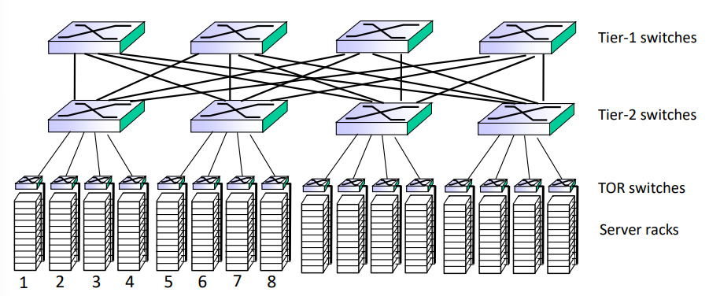

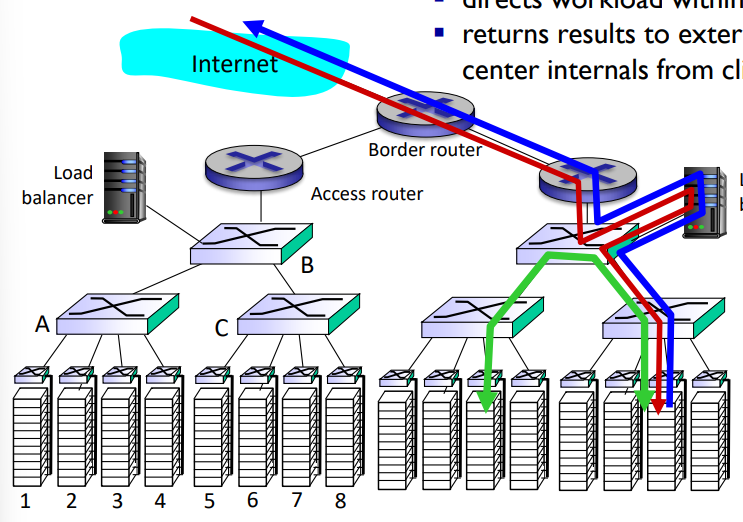

